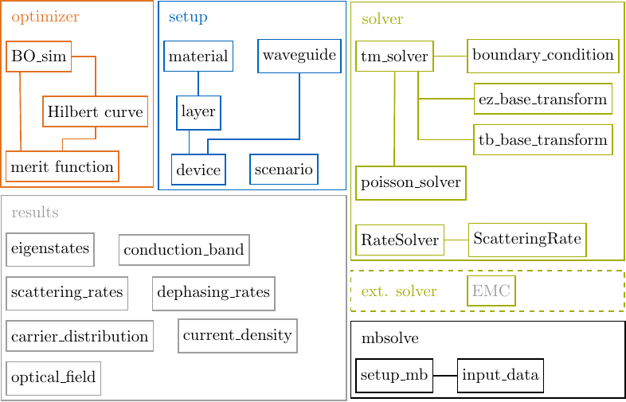

# monacoQC

An object-oriented Matlab-based device engineering tool for quantum cascade
(QC) structures.

## Overview



An object-oriented Matlab-based device engineering tool for quantum cascade
(QC) structures. The project consists of the following modules:

- setup: Includes material, scenario and device classes.
  The material class offers the subclasses binary and ternary,
  which represent all common semiconductor materials. The existing
  materials, e.g. GaAs as a binary or AlGaAs as a ternary, are implemented
  with there specific material properties. An object of a device can be
  composed by defining a period consisting of different well and barrier
  materials. A scenario class specifies the simulation parameters.

- optimizer: The optimizer class BO_sim can be used to execute a
  Bayesian optimization of a QC design.

- solver/schroedinger_poisson:
  Includes solver classes for the Schrödinger and Poisson equations
  to calculate the eigenstates including wavefunctions and eigenenergies for
  a quantum well heterostructure. Here, additional boundary conditions for
  specific basis set configurations are provided.

- solver/rate_equation:
  Provides a solver class for the rate equation and implementations for most
  relevant scattering mechanisms in quantum well heterostructures.

- mbsolve: Includes the class setup_mb for the generation of a
  reduced quantum system description used as input for the dynamical
  simulation within the open-source Maxwell-density matrix tool
  [mbsolve](https://github.com/mriesch-tum/mbsolve).

- results: Contains results classes for integration and processing of
  stationary transport simulation results, e.g. ensemble Monte Carlo
  simulation results.

## Get the code

Make sure to clone this repository with submodules.

```bash
# clone a new repository with submodules
git clone --recurse-submodules [...]
# initialize submodules in an existing repository
git submodule update --init --recursive
```

## Build the documentation

This project uses `Sphinx` as its documentation framework.
Install all the dependencies using `pip` and then build the documentation with
GNU make.

```bash
cd docs
# install dependencies
pip install -r requirements.txt
# build documentation
make html
```
