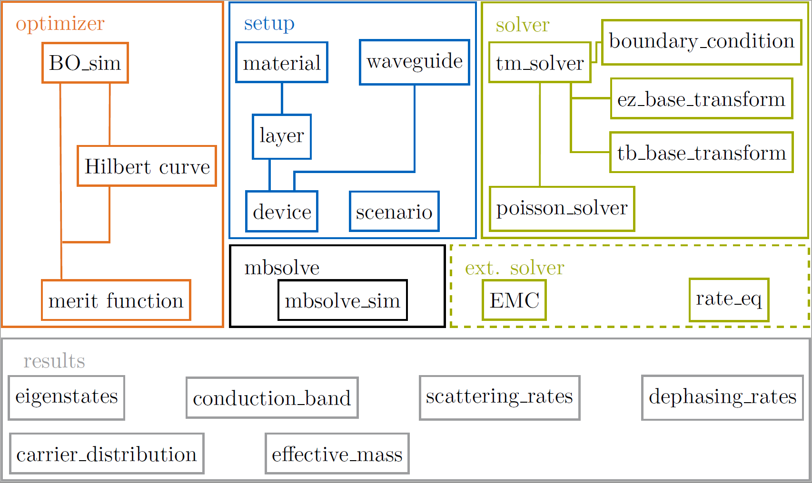

# monacoQC

Contains an object-oriented Matlab-based device engineering tool for 
quantum cascade (QC) structures.

## Overview

An object-oriented Matlab-based device engineering tool for quantum cascade 
(QC) structures. The project consists of the following modules:

- setup: Includes material, scenario and device classes. 
  The material class offers the subclasses binary, ternary and quadternary,
  which represent all common semiconductor materials. The existing 
  materials, e.g. GaAs as a binary or AlGaAs as a ternary, are implemented 
  with there specific material properties. An object of a device can be 
  composed by defining a period consisting of different well and barrier 
  materials. A scenario class specifies the simulation parameters. 
  Different backend classes can be chosen for writing EMC input files. 
  
- optimizer: The optimizer class BO_sim can be used to execute a
  Bayesian optimization of a QC design.

- solver: Includes solver classes for the Schrödinger and Poisson equations 
  to calculate the eigenstates including wavefunctions and eigenenergies for 
  a quantum well heterostructure. Here, additional boundary conditions for 
  specific basis set configurations are provided.

- mbsolve: Includes backend class mbsolve_sim for the generation of a 
  reduced quantum system description used as input for the dynamical 
  simulation within the open-source Maxwell-density matrix tool mbsolve. 

- results: Contains results classes for integration and processing of 
  stationary transport simulation results, e.g. ensemble Monte Carlo 
  simulation results.

## Get the code

Make sure to clone using

    git clone --recurse-submodules [...]

in order to clone the third-party libraries recursively. Alternatively, issue

    git submodule update --init --recursive

in the repository if it already exists.
